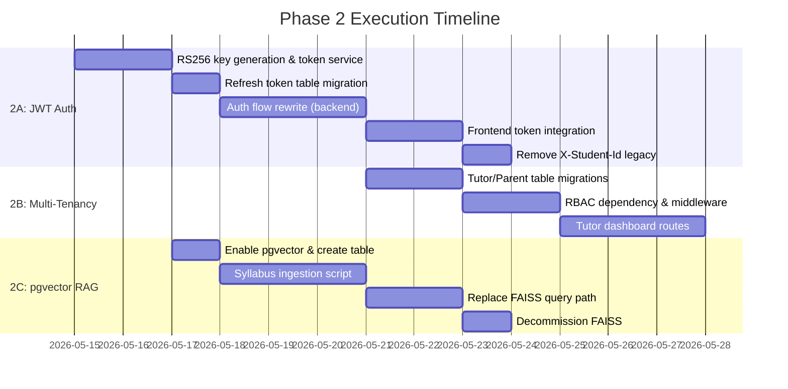

# Postgres Migration: Final Audit & Phase 2 Blueprint

## Part 1 — Pre-Merge Audit

### Verdict: **GO** 🟢

The 4 hotfix commits resolved the critical blockers identified by Codex. 122 of 124 tests pass; the 2 failures (`test_wellness_engine`) are pre-existing on `main` — confirmed by running the same tests against `main` directly. The migration introduces **zero regressions**.

---

### Hotfix Verification Matrix

| Blocker | Fix Applied | Verified |
|---|---|---|
| **IDOR on canvas/auth/analytics** | All object routes now use `_for_student` service variants; ownership enforced via `get_current_student_id` Depends | ✅ Every canvas route scopes queries by `student_id`. Auth `/me/{student_id}` rejects mismatches with 404. Analytics profile routes enforce `student_id != current_student_id → 404`. |
| **Engine disposal on shutdown** | [main.py:57-60](file:///Users/darayeet/Documents/personal%20don't%20open/ALL/MAIT/mait-mvp/backend/app/main.py#L57-L60) — `@app.on_event("shutdown")` calls `await engine.dispose()` | ✅ |
| **Connection pool ceiling** | [session.py:19-20](file:///Users/darayeet/Documents/personal%20don't%20open/ALL/MAIT/mait-mvp/backend/app/db/session.py#L19-L20) — `pool_size=5, max_overflow=3` (8 max per worker) | ✅ |
| **Strict X-Student-Id** | [deps.py:16-17](file:///Users/darayeet/Documents/personal%20don't%20open/ALL/MAIT/mait-mvp/backend/app/deps.py#L16-L17) and [deps.py:26-27](file:///Users/darayeet/Documents/personal%20don't%20open/ALL/MAIT/mait-mvp/backend/app/deps.py#L26-L27) — missing header → 401 | ✅ |
| **`/auth/migrate` disabled** | [auth.py:85-88](file:///Users/darayeet/Documents/personal%20don't%20open/ALL/MAIT/mait-mvp/backend/app/routers/auth.py#L85-L88) — returns 410 Gone | ✅ |

---

### Deeper Findings (Non-Blocking Advisories)

#### Advisory 1: Session held open across Gemini calls (Connection Starvation Risk)

**Severity**: Medium — correct under low load, dangerous under concurrent traffic.

- [revision_service.py:144-203](file:///Users/darayeet/Documents/personal%20don't%20open/ALL/MAIT/mait-mvp/backend/app/services/revision_service.py#L144-L203): `create_revision_for_student` reads the element at `:144`, then `await`s Gemini for up to 30s at `:159-166`, then commits at `:199`. The session (and its pooled connection) is held for the entire Gemini round-trip.
- [chat.py:110-141](file:///Users/darayeet/Documents/personal%20don't%20open/ALL/MAIT/mait-mvp/backend/app/routers/chat.py#L110-L141): `/query` reads history at `:110-112`, awaits Gemini at `:118-125`, then writes messages at `:128-139`. Same pattern.
- [educational_agent.py:44-84](file:///Users/darayeet/Documents/personal%20don't%20open/ALL/MAIT/mait-mvp/backend/app/services/educational_agent.py#L44-L84): `generate_response_async` reads at `:44-47`, awaits Gemini at `:55-62`, writes at `:73-84`.

**Impact**: With `pool_size=5 + max_overflow=3 = 8` connections per worker, 8 concurrent revision or chat requests will exhaust the pool. Additional requests will queue on pool checkout, producing user-visible latency spikes. Under Neon free-tier (25 connections total), 3 Render workers could saturate the project.

**Recommendation** (Phase 2): Split into read-commit-release → external call → new-session-write pattern.

#### Advisory 2: Default lazy-loading on relationships

**Severity**: Low — currently safe because services use explicit `joinedload()`, but fragile.

- [models.py:113-127](file:///Users/darayeet/Documents/personal%20don't%20open/ALL/MAIT/mait-mvp/backend/app/db/models.py#L113-L127): `Document.elements`, `Document.revisions`, `Document.builds` use default lazy loading.
- [models.py:165-166](file:///Users/darayeet/Documents/personal%20don't%20open/ALL/MAIT/mait-mvp/backend/app/db/models.py#L165-L166): `DocumentElement.document`, `DocumentElement.revisions` — default lazy.
- [models.py:195-196](file:///Users/darayeet/Documents/personal%20don't%20open/ALL/MAIT/mait-mvp/backend/app/db/models.py#L195-L196): `DocumentRevision.document`, `DocumentRevision.element` — default lazy.

Current serializers access these relationships only after `joinedload` or manual `element.document = document` assignment, so it works. But any future code that accesses an unloaded relationship in async context will raise `MissingGreenlet`.

**Recommendation** (Phase 2): Add `lazy="raise"` to all relationships to fail-fast on accidental lazy access.

---

### What's Specifically Safe

| Area | Status |
|---|---|
| No module-level or singleton `AsyncSession` | ✅ All sessions via `Depends(get_db)` or `async with async_session_maker()` |
| `expire_on_commit=False` on session maker | ✅ [session.py:29](file:///Users/darayeet/Documents/personal%20don't%20open/ALL/MAIT/mait-mvp/backend/app/db/session.py#L29) |
| `pool_pre_ping=True` | ✅ [session.py:21](file:///Users/darayeet/Documents/personal%20don't%20open/ALL/MAIT/mait-mvp/backend/app/db/session.py#L21) |
| `pool_recycle=1800` | ✅ [session.py:22](file:///Users/darayeet/Documents/personal%20don't%20open/ALL/MAIT/mait-mvp/backend/app/db/session.py#L22) |
| All write service functions explicitly `await session.commit()` | ✅ Verified across all 4 service files |
| Object refresh after commit for returned objects | ✅ `await session.refresh(obj)` present in create/apply patterns |
| FK cascades: Document → Elements (CASCADE), Document → Revisions (CASCADE), Document → Builds (CASCADE), Element → Revisions (SET NULL) | ✅ Match between models.py and migration |
| `.env` in `.gitignore` | ✅ |
| Alembic migration at head (`20260424_000001`) | ✅ |
| No `engine.connect()` leaks outside context managers | ✅ Only usage is `async with engine.begin()` in `storage.init_db()` |
| List endpoints scoped by student_id | ✅ `get_documents_by_student`, `get_elements_for_student`, `list_revisions_for_student` |
| Public-facing routes (`/`, `/subscribe`, `/worksheet-topics`, `/visit`, `/visits`) are correctly unauthenticated | ✅ These are intentionally public |

### What Can't Be Determined Without Production Load

- Exact connection starvation threshold under real Gemini latencies
- Neon cold-start behavior during pool_pre_ping reconnections
- Whether Render's container restart cadence triggers pool_recycle edge cases

---

## Part 2 — Phase 2 Architectural Roadmap

### Phase 2A: JWT Authentication

> **Goal**: Replace `X-Student-Id` header trust with cryptographically signed identity.

#### Step 1: Choose Token Strategy
- **Access token**: Short-lived JWT (15min), signed with RS256
- **Refresh token**: Long-lived opaque token stored in `httponly` cookie, backed by DB row in a new `refresh_tokens` table
- **Provider**: Google OAuth remains the identity provider. The JWT is minted server-side after Google token verification

#### Step 2: New Database Objects (Alembic migration)
```sql
CREATE TABLE refresh_tokens (
    id UUID PRIMARY KEY DEFAULT gen_random_uuid(),
    user_google_id VARCHAR NOT NULL REFERENCES users(google_id) ON DELETE CASCADE,
    token_hash VARCHAR(64) NOT NULL UNIQUE,  -- SHA-256 of the opaque token
    expires_at TIMESTAMPTZ NOT NULL,
    created_at TIMESTAMPTZ NOT NULL DEFAULT now(),
    revoked_at TIMESTAMPTZ
);
CREATE INDEX idx_refresh_tokens_user ON refresh_tokens(user_google_id);
```

#### Step 3: Auth Flow Rewrite
1. `POST /auth/google` → verify Google token → mint access JWT + refresh token → set refresh cookie → return access JWT in body
2. New dependency: `get_current_user(token: str = Depends(oauth2_scheme))` → decode JWT → extract `student_id` + `google_id`
3. `POST /auth/refresh` → validate refresh cookie → rotate refresh token → issue new access JWT
4. `POST /auth/logout` → revoke refresh token

#### Step 4: Migration Path
- Keep `get_current_student_id` as a thin wrapper over `get_current_user().student_id`
- All existing route signatures remain unchanged
- Remove `X-Student-Id` header support after frontend migration
- Deploy behind a feature flag: `AUTH_MODE=jwt|legacy`

#### Step 5: Frontend Integration
- Store access JWT in memory (not localStorage)
- Attach via `Authorization: Bearer <token>` header
- Implement silent refresh via the httponly refresh cookie
- Remove all `X-Student-Id` header injection from API client

---

### Phase 2B: Multi-Tenant Schema

> **Goal**: Add Tutor and Parent roles linked to Students.

#### Step 1: New Tables (Alembic migration)
```sql
-- Tutor accounts (can create worksheets, view student analytics)
CREATE TABLE tutors (
    id UUID PRIMARY KEY DEFAULT gen_random_uuid(),
    google_id VARCHAR NOT NULL UNIQUE,
    email VARCHAR NOT NULL,
    name VARCHAR,
    picture VARCHAR,
    created_at TIMESTAMPTZ NOT NULL DEFAULT now()
);

-- Parent accounts (can view child's progress)
CREATE TABLE parents (
    id UUID PRIMARY KEY DEFAULT gen_random_uuid(),
    google_id VARCHAR NOT NULL UNIQUE,
    email VARCHAR NOT NULL,
    name VARCHAR,
    created_at TIMESTAMPTZ NOT NULL DEFAULT now()
);

-- Link table: which tutor manages which students
CREATE TABLE tutor_students (
    tutor_id UUID NOT NULL REFERENCES tutors(id) ON DELETE CASCADE,
    student_id VARCHAR NOT NULL,  -- references users.student_id
    assigned_at TIMESTAMPTZ NOT NULL DEFAULT now(),
    PRIMARY KEY (tutor_id, student_id)
);

-- Link table: which parent is linked to which students
CREATE TABLE parent_students (
    parent_id UUID NOT NULL REFERENCES parents(id) ON DELETE CASCADE,
    student_id VARCHAR NOT NULL,
    linked_at TIMESTAMPTZ NOT NULL DEFAULT now(),
    PRIMARY KEY (parent_id, student_id)
);
```

#### Step 2: Add `tutor_id` Column
```sql
ALTER TABLE documents ADD COLUMN tutor_id UUID REFERENCES tutors(id) ON DELETE SET NULL;
CREATE INDEX idx_documents_tutor_id ON documents(tutor_id);
```
- `tutor_id` is nullable — student-created documents have `tutor_id = NULL`
- Tutor-assigned worksheets set `tutor_id` on creation

#### Step 3: Role-Based Access Control
- Extend JWT claims: `{"role": "student|tutor|parent", "sub": "google_id", "student_id": "...", "tutor_id": "..."}`
- New dependency: `require_role(allowed: list[str])` → checks JWT role claim
- Tutor can read/write documents for their linked students
- Parent can read (not write) analytics for their linked students
- Student can only access their own data (current behavior preserved)

#### Step 4: Schema Future-Proofing Assessment
The current schema is well-positioned:
- `documents.student_id` is a plain string, not a FK → adding `tutor_id` alongside is non-breaking
- `idx_documents_student_id` already exists → compound index `(tutor_id, student_id)` can be added
- No table restructuring needed — it's purely additive

---

### Phase 2C: pgvector RAG Pipeline

> **Goal**: Replace FAISS with Postgres-native vector search for the NESA Math Syllabus corpus.

#### Step 1: Enable pgvector on Neon
```sql
CREATE EXTENSION IF NOT EXISTS vector;
```
Neon supports pgvector natively on all plans.

#### Step 2: New Table (Alembic migration)
```sql
CREATE TABLE syllabus_embeddings (
    id UUID PRIMARY KEY DEFAULT gen_random_uuid(),
    year_level INTEGER NOT NULL,
    strand VARCHAR NOT NULL,
    topic_id VARCHAR NOT NULL,         -- e.g. "calc-12-1"
    chunk_text TEXT NOT NULL,           -- the raw syllabus text chunk
    embedding VECTOR(768) NOT NULL,    -- dimension depends on embedding model
    metadata_json JSONB NOT NULL DEFAULT '{}'::jsonb,
    created_at TIMESTAMPTZ NOT NULL DEFAULT now()
);

-- HNSW index for fast approximate nearest neighbor search
CREATE INDEX idx_syllabus_embedding_hnsw
    ON syllabus_embeddings
    USING hnsw (embedding vector_cosine_ops)
    WITH (m = 16, ef_construction = 64);

CREATE INDEX idx_syllabus_year_level ON syllabus_embeddings(year_level);
CREATE INDEX idx_syllabus_topic_id ON syllabus_embeddings(topic_id);
```

#### Step 3: Embedding Model Selection
- **Recommended**: `text-embedding-004` (Google, 768 dimensions, free tier available)
- **Alternative**: `voyage-3-lite` if cross-provider diversity is needed
- Chunk the NESA syllabus PDFs at ~300 token windows with 50-token overlap

#### Step 4: Ingestion Pipeline
1. Parse NESA syllabus documents (PDF → text via `pymupdf` or `pdfplumber`)
2. Chunk by dot-point / outcome / section header
3. Embed each chunk via the chosen model
4. Bulk insert into `syllabus_embeddings` via a management script (`scripts/ingest_syllabus.py`)
5. Store metadata: `{year_level, strand, topic_id, outcome_codes[], source_page}`

#### Step 5: Query Integration
Replace `syllabus_service.get_relevant_context()` internals:
```python
async def get_relevant_context(session, query: str, year: int | None) -> str:
    query_embedding = await embed(query)  # call embedding API
    
    stmt = select(SyllabusEmbedding).order_by(
        SyllabusEmbedding.embedding.cosine_distance(query_embedding)
    ).limit(5)
    
    if year:
        stmt = stmt.where(SyllabusEmbedding.year_level == year)
    
    results = await session.execute(stmt)
    chunks = results.scalars().all()
    return "\n\n".join(c.chunk_text for c in chunks)
```

#### Step 6: Decommission FAISS
- Remove `faiss-cpu` from `requirements.txt`
- Remove the FAISS index files from the repository
- Update `syllabus_service.py` to use the pgvector query path
- Keep the service interface identical so chat/query routes need zero changes

---

### Execution Order



> [!IMPORTANT]
> **Phase 2A (JWT) is the critical path.** Multi-tenancy and pgvector can proceed in parallel once JWT lands, but they depend on the role-based identity system being in place.
